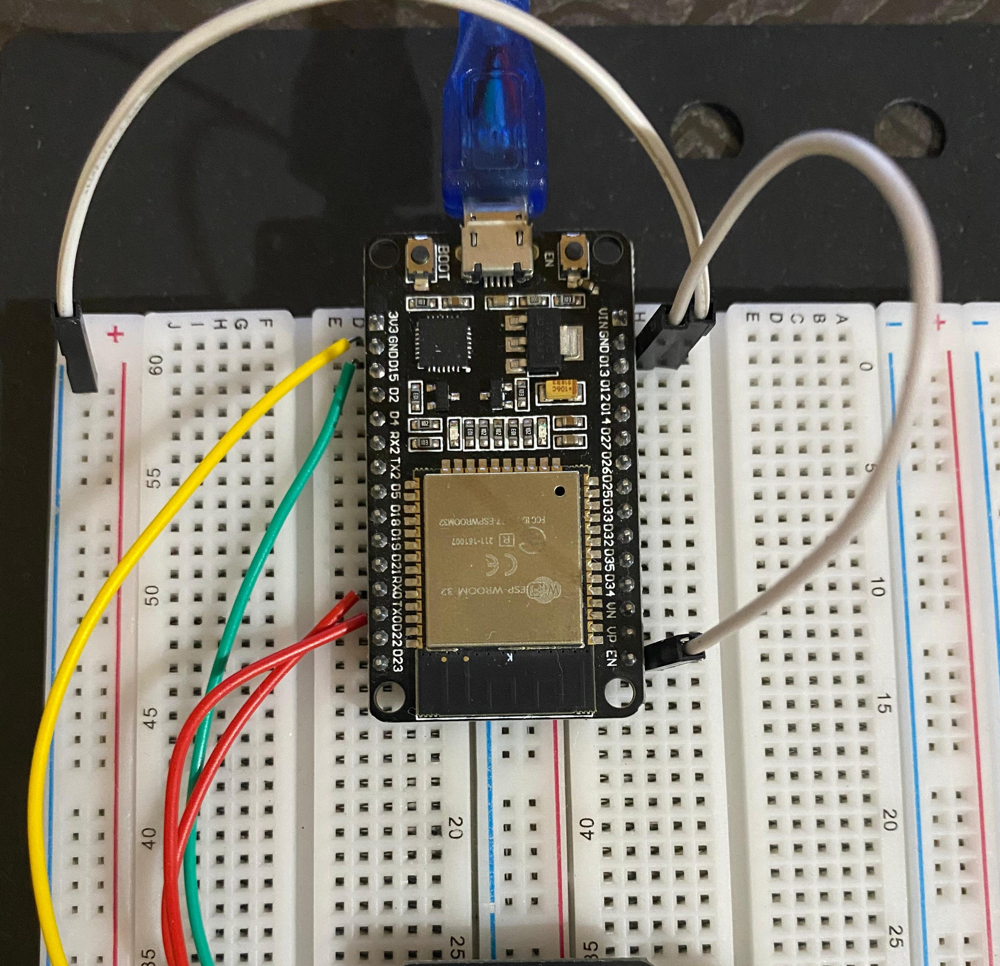

# 📸 AI Thinker ESP32-CAM  

This project is a core component of a **face recognition-based attendance system** using the ESP32-CAM. It captures an image when a button is pressed and securely uploads it to an Azure Function via HTTP.Then a visual feedback is provided using LEDs based on the function's response.

---

### 🔧 Hardware Setup

#### GPIO Pin Mapping

| Component     | GPIO Pin | Purpose           |
| ------------- | -------- | ----------------- |
| Flashlight    | GPIO 4   | Illuminates scene |
| Push Button   | GPIO 12  | Trigger capture   |
| Green LED     | GPIO 2   | Success indicator |
| Red LED       | GPIO 13  | Failure indicator |

---

### 📁 WiFi Configuration

Update the following variables in the code:

```cpp
const char* ssid = "YOUR_SSID";
const char* password = "YOUR_PASSWORD";
const char* SERVER_URL = "SERVER_URL";
```

---

### 🚀 System Behavior

#### setup()
- Initializes serial communication
- Configures pins
- Connects to WiFi
- Initializes camera

#### loop()
- Waits for button press, Once pressed:
    - Turns on camera flash  
    - Captures and uploads image
- Provides LED feedback
- Debounces with 5-second delay

---

### 🔐 Secure Upload

The image is sent using `WiFiClientSecure` and `HTTPClient`:

```cpp
WiFiClientSecure client;
client.setInsecure();
HTTPClient http;
http.addHeader("Content-Type", "image/jpeg");
http.POST(img->data(), img->size());
```

**Note:** `setInsecure()` allows self-signed certificates, recommended only for development.

---

### ✅ Server Response Handling

| Status Code | Meaning             | LED Indicator |
| ----------- | ------------------- | ------------- |
| 200         | Image received      | Green ON      |
| 400         | Bad request         | Red ON        |
| Other       | Error during upload | Red ON        |

---

### 💼 Dependencies

Ensure these libraries are installed in Arduino IDE:

- `esp32cam` (e.g. by Mikael Patel)
- `WiFi.h` (built-in)
- `HTTPClient.h` (built-in)
- `WiFiClientSecure.h` (built-in)

---
# 🏿 ESP32 DevKit v1

The ESP32 was used in this project to upload code to the ESP32-CAM and to supply it with power during development.

---

### 🔧 Hardware Setup

#### GPIO Pin Mapping

| GPOI Pin Esp32| GPIO Pin CAM | 
| ------------- | --------     | 
| 3v3           |   3v3        | 
| GND           |   GND        | 
| RX0           |   UOR        | 
| TX0           |   UOT        | 

---


